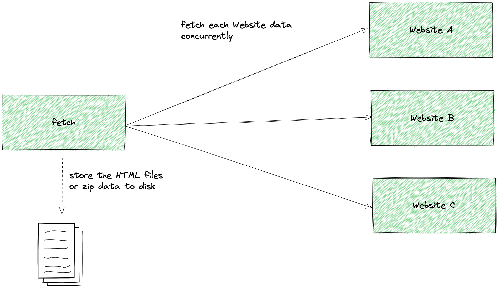

# fetch

[](https://github.com/moemoe89/fetch/actions/workflows/ci.yml) <!-- start-coverage --><!-- end-coverage -->


fetch is a command line interface (CLI) program written in [Golang](https://go.dev/)
that can be used to download web pages and save their content to disk for later use. The contents can also be compressed into a zip file for convenience.

## Flow Diagram

---




## Building fetch

To build `fetch`, clone this repository and compile the application using the following commands:

```bash
cd fetch
go build -o fetch ./cmd
```

Alternatively, use the make command:

```bash
make build
```

## Using fetch

`fetch`  requires at least one URL as an argument. Multiple URLs can be specified as needed:

```bash
fetch https://moemoe89.github.io
fetch https://moemoe89.github.io https://www.google.com
```

If you want to fetch the assets along with the zip file, include the `--metadata` or `-metadata` argument:

```bash
fetch --metadata https://moemoe89.github.io
```

or

```bash
fetch -metadata https://moemoe89.github.io
```

> NOTE:
> If the binary is not in your PATH, you need to run it directly like this: ./fetch https://moemoe89.github.io.

## Running with Docker

You can also run fetch using Docker. To build the Docker image, use the following command:

```bash
make docker-build
```

To run the Docker image, use the following command:

```bash
make docker-run
```

## Future Improvements

There are several improvements that can be made to fetch in the future, such as:

* Increasing test coverage.
  * Currently, crucial code lacks tests. However, the `fetcher` package implements the HTTP Client interface, making it easier to mock HTTP requests.
* Adding volume support in Docker.
  * Currently, when run in Docker, the downloaded pages are stored inside the container. Adding volume support would allow for the storage of files on the host system.
